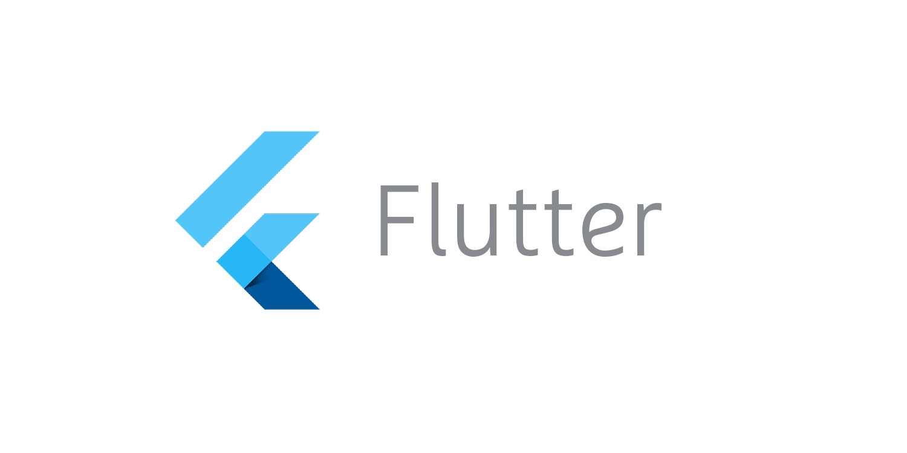
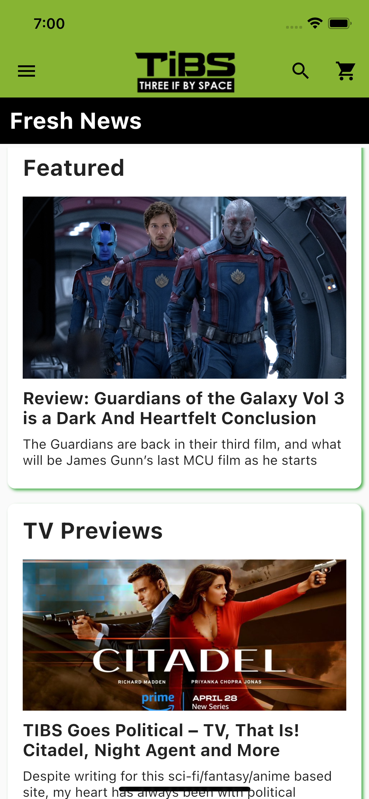
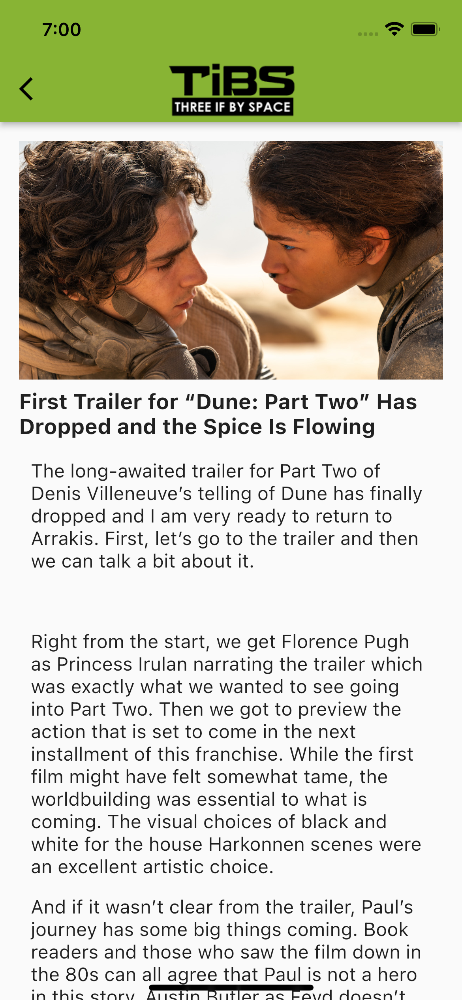
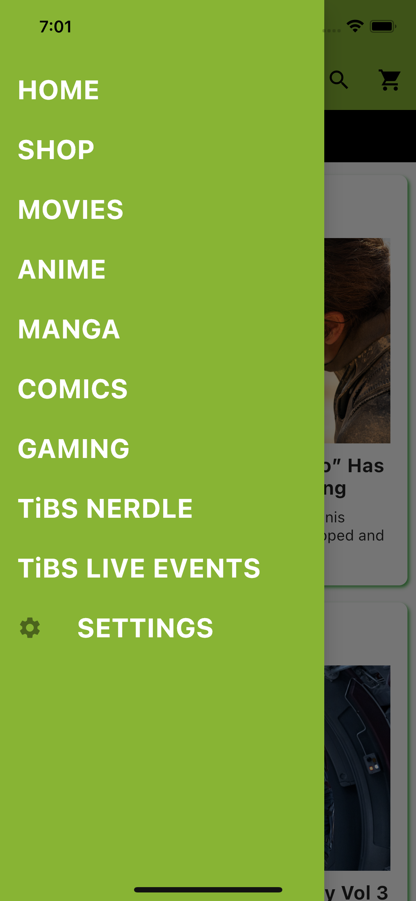
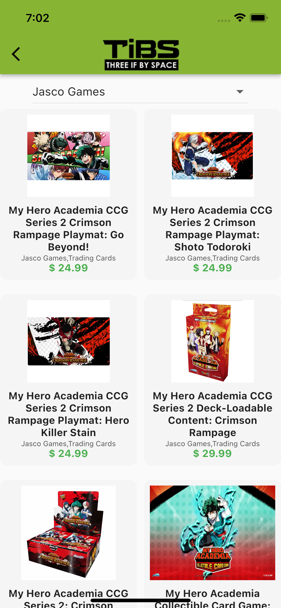
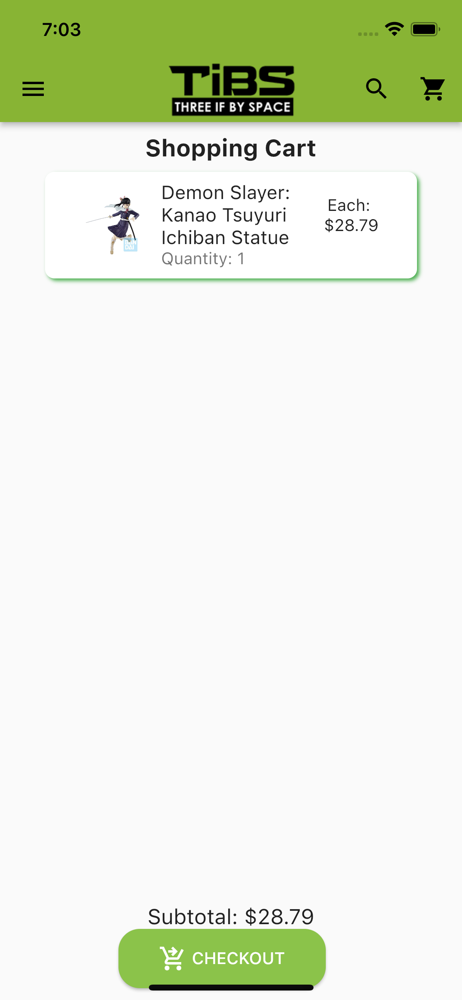
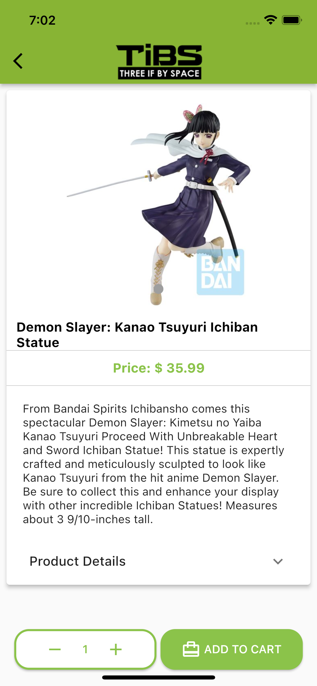
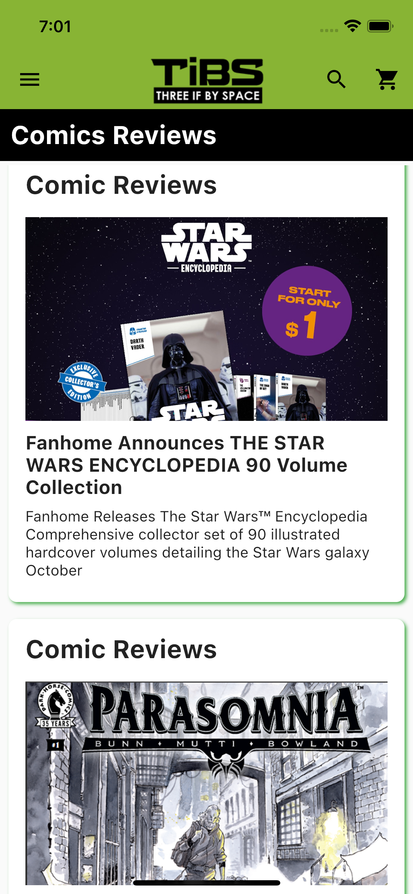
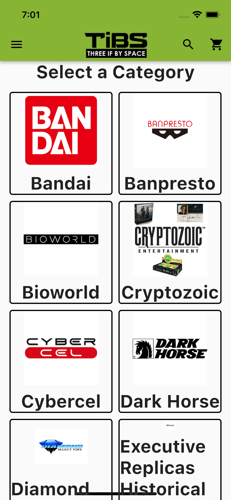
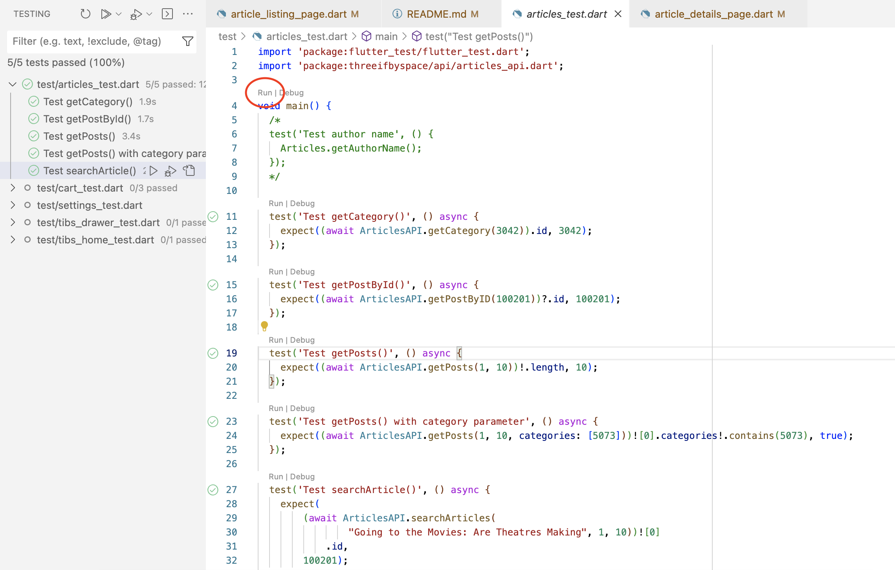

# Silicon Valley - CSUS Senior Project

    

*Note: The source code of the project is closed per the request of the owner. If you would like to see the source code, reach out to me via email.*

## Synopsis

The Silicon Valley project is being undertaken by the development team Uncodables, comprised of undergraduate students majoring in Computer Science at California State University, Sacramento.

The client’s business currently has a website, but not a mobile application. The website provides two sections: An article/blog section for users to read and a shop section for users to purchase items. Articles/blogs are about things such as TV/Movies, Manga, and Anime. The shop sells items such as Funko pops, pins, plushies, board games, and figurines.

In order to expand his business and user base, he would like to have a mobile app that is representative of what the website looks like, supporting both the article and shop section, preferably supporting both Android and iOS.

The mobile application name would be ThreeIfBySpaceApp.
Silicon Valley project is to create a mobile application for Three If By Space using Flutter as the framework.

[Check out TiBS website here](https://www.threeifbyspace.net/)

## Screenshots of Product
 &nbsp;   &nbsp;   &nbsp;      
 &nbsp;   &nbsp;   &nbsp;  

## Testing
The test folder contains all the test files to test all the functions and classes. The names of the files end with 'test.dart'. After opening the testing file, click on "run" at the top of the main function.  

## Deployment
The TiBS app is developed for iOS and Android platforms. The deployment process is different for both platforms.

### iOS deployment instructions

1. [Signing up for an iOS developer account](https://www.embarcadero.com/starthere/xe5/mobdevsetup/ios/en/signing_up_for_a_developer_account.html)
2. [Acquiring a Developer Certificate](https://www.embarcadero.com/starthere/xe5/mobdevsetup/ios/en/acquiring_a_developer_certificate.html)
3. [Provisioning Your iOS Device](https://www.embarcadero.com/starthere/xe5/mobdevsetup/ios/en/provisioning_your_ios_device.html)
4. [Submission to the App Store](https://www.embarcadero.com/starthere/xe5/mobdevsetup/ios/en/deploying_your_ios_application_for_submission_to_the_app_store.html)

### Android deployment instructions

The Android app can be released through an app marketplace such as Google Play. However, the owner can post a link to download on their website or send the app directly to a user.

1. [Release your apps on Google Play](https://developer.android.com/studio/publish#publishing-market)
2. [Release through a website](https://developer.android.com/studio/publish#publishing-website)

## Developer Instructions to setup the environment
Software needed for development:
- [Flutter](https://docs.flutter.dev/get-started/install) - Its installation guide will install a set of other software in order to run Flutter projects like this app.

### Guide for VSCode to execute the code
- Download the repository and open the folder in VSCode
- Open up either an Android or iOS emulator on the bottom right by clicking on the platform button 

- Choose either iOS or Android emulator 

- Run the program from main.dart 

## Tech Stack
1. Flutter Framework
2. Dart programming Language.
3. MySQL Database 
4. CENTOS 07 OS Linux Server
5. VS Code IDE

## Supportive Operating Systems
1. iOS
2. Android

## External API Documentation

### WordPress API

#### API to access WordPress

<https://pub.dev/packages/wordpress_api>

#### WordPress REST API Documentation

<https://developer.wordpress.org/rest-api/reference/posts/>

### WooCommerce API

#### API to access WooCommerce

<https://pub.dev/packages/woocommerce_api>

#### WooCommerce REST API Documentation

<https://woocommerce.github.io/woocommerce-rest-api-docs/>

## Contributors
1. Bhupinder jit Mehton - bmehton@csus.edu
2. Dalen Hurtt - dalenhurtt@csus.edu
3. Gursevak Singh - gursevaksingh@csus.edu
4. James Armstrong - jmarmstrong@csus.edu
5. Joshua Degmetich - jdegmetich@csus.edu
6. Minh-Hieu Le - minhhieule@csus.edu
7. Prachi Shah - ppshah@csus.edu
8. Quintilian Huynh - qhuynh@csus.edu
